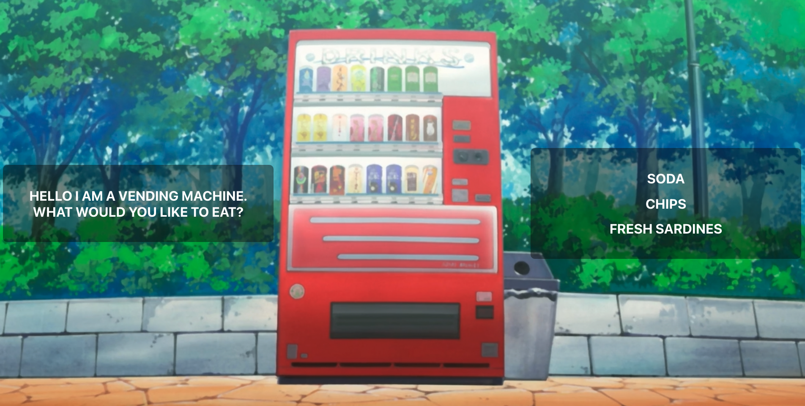

# Vending Machine App

This project was bootstrapped with [Create React App](https://github.com/facebook/create-react-app).

This application consists of the following:
A VendingMachine component, which shows a page with a list of snacks that you can get from the vending machine.  

Three different snack components, each one corresponding to a vending machine snack.
By clicking on an item in the VendingMachine you can view one of things inside of the machine. Clicking updates the URL and show the snack that you’ve clicked on.  

From each snack component, you can go back to the main VendingMachine component.

